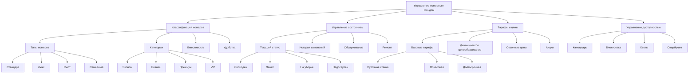
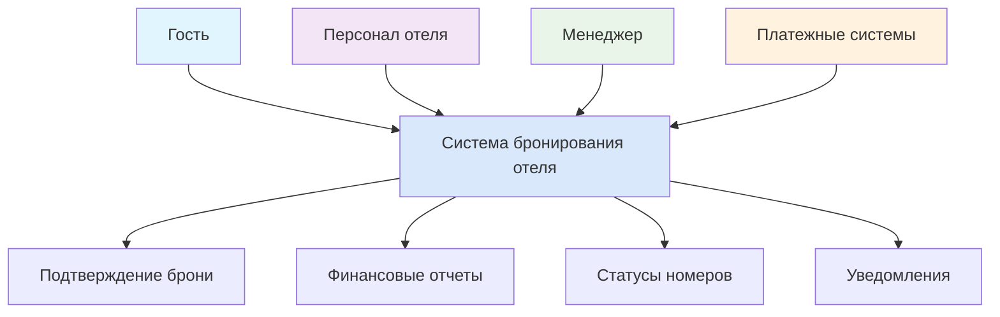
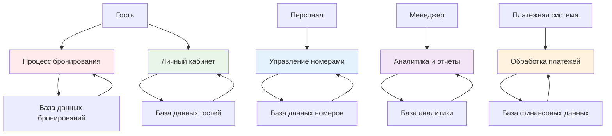
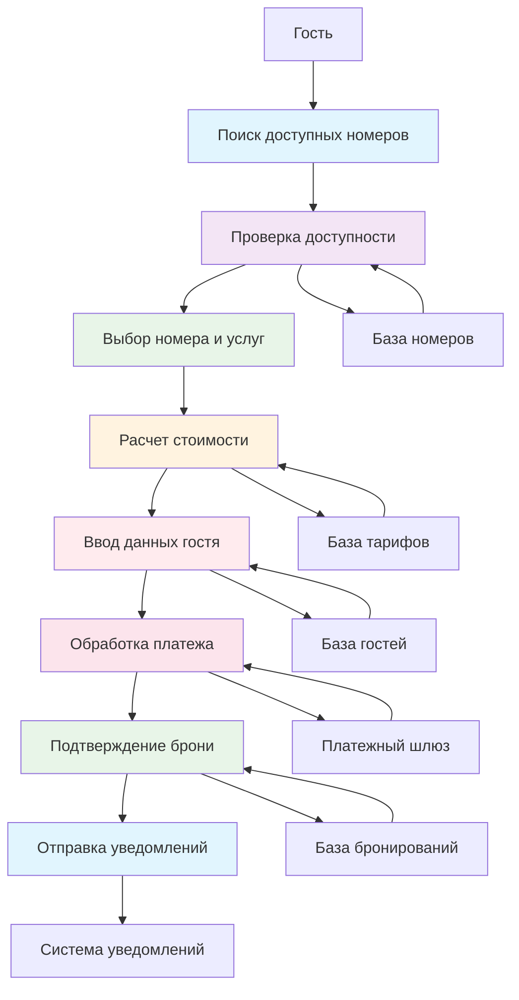
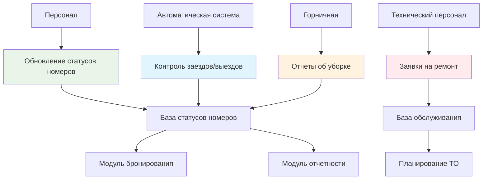

# 🏨 Moscow Harmony Hotel - Информационная система

## 📋 Краткое описание проекта

### 👨‍💻 1.1. Ф.И.О. разработчиков
- **Митрофанов Богдан Дмитриевич**
- **Бондарев Дмитрий Алексеевич**

### 🎓 1.2. Группа
**Д-Э-306**

### 🎯 1.3. Тема проекта
**Разработка информационной системы отеля в Москве**

### 🚀 1.4. Цель проекта
Создание современного и удобного веб-приложения для онлайн-бронирования номеров в отеле «Московский», которое позволит увеличить количество бронирований и улучшить качество обслуживания клиентов.

### 📊 1.5. Задачи проекта

#### 🛎️ Система бронирования
- [ ] Онлайн-бронирование номеров с выбором дат и услуг 📅
- [ ] Система временного резервирования (30 минут) ⏳
- [ ] Интерактивная схема этажей для выбора номеров 🗺️
- [ ] Поддержка авторизованных и неавторизованных пользователей 👨‍💻

#### 👥 Пользовательская система
- [ ] Регистрация и личные кабинеты для гостей 🏠
- [ ] Система ролей: гости, персонал, менеджеры, администраторы 🎭
- [ ] Управление профилями и историей бронирований 📊

#### ⚙️ Административная панель
- [ ] Управление номерным фондом и тарифами 💰
- [ ] Контроль бронирований и статусов номеров 📋
- [ ] Управление дополнительными услугами 🧼

#### 📈 Система отчетности
- [ ] Аналитика бронирований и загрузки номеров 📊
- [ ] Мониторинг KPI отеля (RevPAR, Occupancy Rate) 📉
- [ ] Генерация отчетов для руководства 👨‍💼

#### 🚀 Технические требования
- [ ] Поддержка 500+ одновременных пользователей 👥
- [ ] Защита от двойного бронирования 🛡️
- [ ] Время загрузки страниц до 3 секунд ⚡
- [ ] Многоязычная поддержка 🌐

#### 🔐 Безопасность и надежность
- [ ] Защита персональных данных (ФЗ-152) 🇷🇺
- [ ] HTTPS, защита от SQL-инъекций, XSS, CSRF 🛡️
- [ ] Система резервного копирования 💾
- [ ] Отказоустойчивость при пиковых нагрузках 🚀

#### 🛠️ Внедрение и сопровождение
- [ ] Развертывание на серверах 🖥️
- [ ] Обучение персонала 👩‍🏫
- [ ] Техническая поддержка 🛟
- [ ] Документация для пользователей и администраторов 📚

## 🎯 Аннотация

Проект представляет собой разработку современной информационной системы для автоматизации процессов управления отелем "Moscow Harmony Hotel" в Москве. Система обеспечивает комплексное решение для онлайн-бронирования номеров, управления гостями, обработки платежей и аналитики деятельности отеля. 

## 💫 Ключевые возможности

### 🛎️ Бронирование и бронирование
- **Онлайн-бронирование номеров** с интерактивной схемой выбора
- **Система временного резервирования** (30 минут)
- **Мгновенное подтверждение** бронирования

### 👥 Управление доступом
- **Многоуровневая система пользователей** 
- **Разделение прав доступа**: гости, персонал, менеджеры, администраторы
- **Личные кабинеты** для каждого типа пользователей

### 💳 Финансовые операции
- **Интегрированная платежная система**
- **Поддержка онлайн-оплат** и расчетов при заселении
- **Автоматизация финансовых отчетов**

### 🏠 Управление отелем
- **Автоматизированное управление номерным фондом**
- **Контроль занятости** в реальном времени
- **Динамическое ценообразование** и тарификация

### 📊 Аналитика и отчетность
- **Комплексная аналитика** KPI отеля
- **Мониторинг показателей**: RevPAR, Occupancy Rate
- **Генерация отчетов** для руководства

### 🌐 Интернационализация
- **Многоязычная поддержка** для международных гостей
- **Адаптация под разные языки** и валюты

# 📋 Документация проекта "Moscow Harmony Hotel"

## 2.1. Подробное описание проекта

### 🎯 Цель проекта
Разработка комплексной информационной системы для автоматизации бизнес-процессов отеля "Moscow Harmony Hotel", обеспечивающей повышение качества обслуживания гостей и операционной эффективности.

#### 🛎️ Система бронирования
- [ ] Онлайн-бронирование номеров с выбором дат и услуг 📅
- [ ] Система временного резервирования (30 минут) ⏳
- [ ] Интерактивная схема этажей для выбора номеров 🗺️
- [ ] Поддержка авторизованных и неавторизованных пользователей 👨‍💻

#### 👥 Пользовательская система
- [ ] Регистрация и личные кабинеты для гостей 🏠
- [ ] Система ролей: гости, персонал, менеджеры, администраторы 🎭
- [ ] Управление профилями и историей бронирований 📊

#### ⚙️ Административная панель
- [ ] Управление номерным фондом и тарифами 💰
- [ ] Контроль бронирований и статусов номеров 📋
- [ ] Управление дополнительными услугами 🧼

#### 📈 Система отчетности
- [ ] Аналитика бронирований и загрузки номеров 📊
- [ ] Мониторинг KPI отеля (RevPAR, Occupancy Rate) 📉
- [ ] Генерация отчетов для руководства 👨‍💼

#### 🚀 Технические требования
- [ ] Поддержка 500+ одновременных пользователей 👥
- [ ] Защита от двойного бронирования 🛡️
- [ ] Время загрузки страниц до 3 секунд ⚡
- [ ] Многоязычная поддержка 🌐

#### 🔐 Безопасность и надежность
- [ ] Защита персональных данных (ФЗ-152) 🇷🇺
- [ ] HTTPS, защита от SQL-инъекций, XSS, CSRF 🛡️
- [ ] Система резервного копирования 💾
- [ ] Отказоустойчивость при пиковых нагрузках 🚀

#### 🛠️ Внедрение и сопровождение
- [ ] Развертывание на серверах 🖥️
- [ ] Обучение персонала 👩‍🏫
- [ ] Техническая поддержка 🛟
- [ ] Документация для пользователей и администраторов

## 2.2.  Moscow Harmony Hotel - Ментальная карта системы

## 🌟 Гостевой сервис
| Модуль | Функциональность | Особенности |
|--------|------------------|-------------|
| **👤 Профили гостей** | • Личные данные • Предпочтения • История пребываний | 🎯 Персонализация |
| **💬 Обслуживание** | • Запросы гостей • Отзывы и рейтинги • Программа лояльности | ⭐ Повышение качества |

## 🎯 Бронирование и продажи
| Модуль | Функциональность | Особенности |
|--------|------------------|-------------|
| **🔍 Поиск номеров** | • Фильтры по датам/типу/цене • Поиск по удобствам • Сортировка результатов | 🚀 Удобный поиск |
| **📅 Процесс бронирования** | • Выбор дат • Дополнительные услуги • Подтверждение | ⚡ Быстрое бронирование |
| **🔄 Управление бронями** | • Изменение брони • Отмена • История | 🔄 Гибкость |

## 💬 Ментальная карта с комментариями

# 2.4. Фрагменты модели в нотации DFD (с комментариями)

## DFD Уровень 0: Контекстная диаграмма

### Комментарий к DFD Уровень 0:
- Внешние сущности: Гость, Персонал, Менеджер, Платежные системы
- Основной процесс: Система бронирования отеля
- Потоки данных: Запросы, подтверждения, отчеты, уведомления
- Назначение: Определение границ системы и внешних взаимодействий

## DFD Уровень 1: Основные процессы системы

### Комментарий к DFD Уровень 1:

- Ключевые процессы:: Бронирование номеров, Управление личным кабинетом, Управление номерным фондом, Аналитика и отчетность,Обработка платежей
- Хранилища данных: 5 основных баз данных
- Потоки : Двустороннее взаимодействие процессов с хранилищами

## DFD Уровень 2: Процесс бронирования (детализация)

### Комментарий к DFD Уровень 2:

- Последовательность процессов : Линейный поток от поиска до подтверждения
- Критические точки: Проверка доступности (интеграция с базой номеров),Обработка платежа (внешнее взаимодействие),Подтверждение (обновление статусов)
- Хранилища : Специализированные базы для каждого типа данных

## DFD Уровень 2: Управление номерным фондом

### Комментарий к DFD Уровень 2:

- Полный цикл : От генерации счета до итогового расчета
- Корректировки: Учет дополнительных услуг при заселении
- Отчетность : Разделение на налоговую и управленческую
- Аналитика: Основа для принятия бизнес-решений

# 2.5.  Модель в нотации BPMN (с комментариями).

# 2.6.  Модели в нотации UML (три типа).

## 2.6.1 Диаграмма классов

## 2.6.1 Диаграмма вариантов использования

